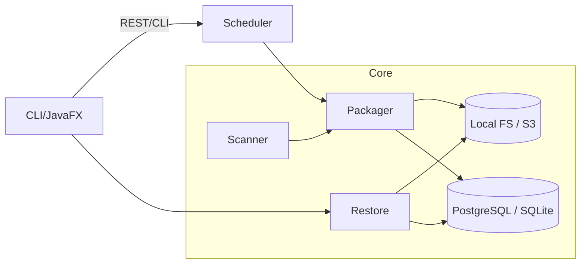
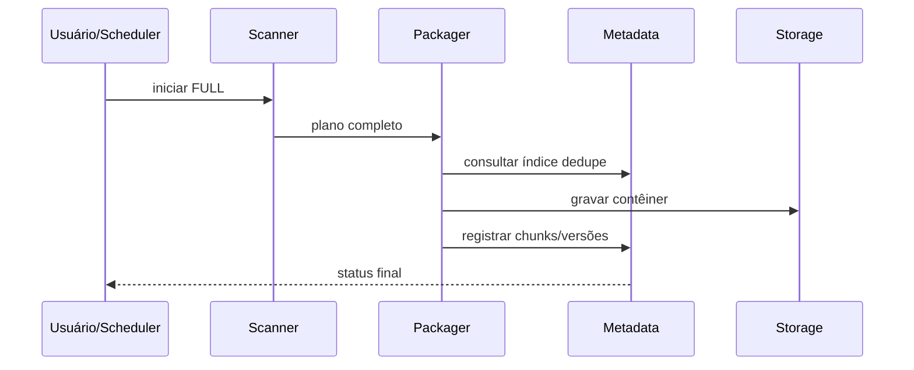
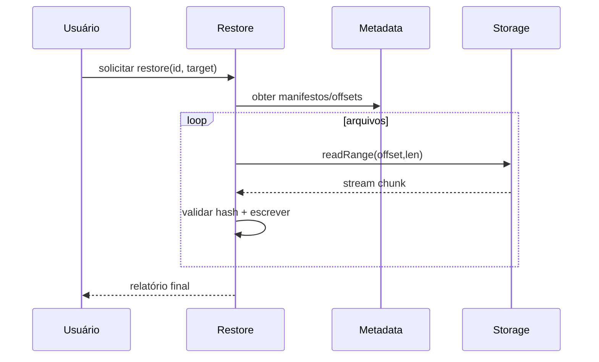

# Documentação Técnica – Keeply Backup Agent

## 1. Visão Geral do Sistema
- **Propósito**: Agente de backup com deduplicação por chunks para proteger diretórios locais, empacotar dados em contêineres comprimidos e armazenar metadados relacionais para restauração íntegra e eficiente.
- **Problema de negócio**: Reduzir custo e janela de backup/restauração em ambientes com alta redundância de arquivos, mantendo rastreabilidade de versões e suportando execuções manuais ou agendadas.
- **Escopo**: Varredura de arquivos, geração de plano FULL/INCREMENTAL, deduplicação e compressão com ZSTD, armazenamento em filesystem/S3, persistência relacional, restauração seletiva, agendamento e interface de controle (CLI/JavaFX). Fora de escopo: multi-tenant completo, RBAC avançado, políticas de retenção automatizadas de data lake.
- **Personas**: Administrador de TI/DevOps, operador de suporte para restauração, usuário avançado que configura proteções locais.
- **Principais módulos**: Scanner, Metadata Store, Packager, Storage Local/S3, Scheduler, Restore Service, Interface CLI/desktop JavaFX.【F:readme.md†L16-L200】【F:pom.xml†L23-L208】

## 2. Contexto e Requisitos
### Requisitos Funcionais
- Varredura de diretórios configurados e geração de plano de backup FULL/INCREMENTAL com heurística de mudança por timestamp/tamanho e opção de hash completo.【F:readme.md†L16-L29】
- Deduplicação global de chunks com hash forte e reuso entre execuções.【F:readme.md†L6-L161】
- Empacotamento em contêiner `.tar.zst` ou similar com registro de offsets e manifesto de chunks.【F:readme.md†L42-L170】
- Persistência de metadados para backups, arquivos, versões, chunks e contêineres com histórico auditável.【F:readme.md†L30-L151】
- Upload/download via storage local ou S3 com suporte a leitura por faixa para restauração eficiente.【F:readme.md†L55-L200】【F:pom.xml†L101-L126】
- Agendamento de backups, prevenção de concorrência simultânea por repositório e registro de status/estatísticas.【F:readme.md†L66-L75】
- Restauração completa ou parcial preservando atributos básicos e validando hashes.【F:readme.md†L76-L200】
- Interface de controle CLI/JavaFX para acionar backup, listar snapshots e restaurar.【F:readme.md†L88-L98】【F:pom.xml†L60-L208】

### Requisitos Não Funcionais
- **Disponibilidade**: tolerância a falhas individuais de arquivo; retentativas em upload S3; locks para evitar colisões; possibilidade de retomar jobs marcados EM_ANDAMENTO (assunção).
- **Desempenho**: chunking configurável (1–4 MB), compressão ZSTD, paralelismo controlado, leitura por range em S3.
- **Segurança**: hashes fortes, TLS para S3/PostgreSQL, credenciais via `.env`/variáveis de ambiente, logs sem dados sensíveis.【F:pom.xml†L53-L126】
- **Escalabilidade**: dedupe global, contêineres imutáveis, índice de chunks com estrutura em memória (HashSet/Bloom filter – assunção) para lookup rápido.
- **Observabilidade**: logs estruturados, métricas de arquivos/chunks/bytes, health-check HTTP via Spring Actuator (assunção).【F:pom.xml†L23-L39】
- **Confiabilidade**: atomicidade na gravação de contêineres e transações de metadados; validação de hash na restauração.【F:readme.md†L163-L200】
- **Backup/Restore**: retenção configurável e limpeza planejada de chunks órfãos (assunção futura).【F:readme.md†L153-L189】

### SLOs sugeridos (assunção)
| Dimensão | Objetivo | Medição |
| --- | --- | --- |
| Sucesso de backup | ≥ 99% dos jobs mensais completam sem erro crítico | ratio `backups_sucesso/backups_totais` |
| Throughput de leitura | ≥ 150 MB/s em filesystem local; ≥ 80 MB/s em S3 (dependente de rede) | métricas de bytes por etapa |
| Latência de restauração parcial (100 arquivos) | P95 ≤ 3 min em rede local | timers por etapa | 
| Integridade | 100% dos arquivos restaurados com hash validado | contagem de verificações |

### Restrições e Premissas
- **Dependências técnicas**: JDK 21+, Maven, acesso a PostgreSQL/Supabase ou SQLite; bucket S3 ou filesystem local; dotenv para carregar variáveis.【F:pom.xml†L17-L208】
- **Ambiente**: rede com saída TLS para S3; permissões de leitura nos diretórios protegidos; storage local com espaço para staging de contêineres.【F:readme.md†L6-L65】
- **Licenciamento/custos**: uso de AWS S3 e Supabase gera custos; compressão ZSTD via `zstd-jni`.
- **Assunções adicionais**: API REST interna exposta pelo Spring Boot para orquestração; JavaFX como UI desktop conforme dependências do POM.【F:pom.xml†L23-L208】

## 3. Arquitetura de Alto Nível
- **Estilo**: Monólito modular Java com fronteiras internas bem definidas; integração externa com S3/PostgreSQL; interface CLI/desktop aciona serviços locais.
- **Fluxo geral**: Scanner gera plano → Packager divide e deduplica chunks → Storage grava contêiner → Metadata Store registra índices → Scheduler orquestra → Restore usa metadados + contêiner para reidratar arquivos.
- **Diagrama lógico (sugerido)**:

- **Padrões**: dedupe por conteúdo (hash), contêineres imutáveis, locks por repositório, commit atômico de contêiner + metadados, fallback de storage (local/S3).

## 4. Componentes e Módulos
### Scanner de Sistema de Arquivos
- **Tipo**: Serviço local de varredura.
- **Responsabilidades**: Percorrer diretórios, aplicar filtros, comparar com snapshot anterior, gerar `BackupPlan` FULL/INCREMENTAL, identificar deleções.
- **Entradas/Saídas**: Diretórios configurados + snapshot base → lista de `FileMetadata` com caminho relativo, tamanho, timestamps, tipo e hash opcional.
- **Tecnologias**: Java NIO2 (`Files.walkFileTree`), thread pool configurável.
- **Padrões**: Strategy para filtros; Template Method para modos FULL/INCREMENTAL (assunção).
- **Falhas e mitigação**: arquivos inacessíveis registrados em `operacao_log`; continuar processamento; alertar via métrica `scan_errors_total` (assunção).

### Metadata Store
- **Tipo**: Abstração de persistência relacional.
- **Responsabilidades**: Registrar backups, arquivos, versões, chunks e contêineres; fornecer índice de dedupe; expor consultas para restore e locks de agendamento.
- **Entradas/Saídas**: CRUD de entidades; lookup de versões por caminho/hash; geração de relatórios.
- **Tecnologias**: PostgreSQL/Supabase principal, SQLite local; JDBC/REST (assunção); transações.
- **Padrões**: Repository; Adapter para drivers.
- **Integridade**: FKs entre versões/chunks; uso de `refcount` ou GC para chunks órfãos; auditoria opcional em `operacao_log`.

### Packager
- **Tipo**: Worker de empacotamento/compressão.
- **Responsabilidades**: Dividir arquivos em chunks, calcular hashes, consultar índice de dedupe, comprimir novos chunks com ZSTD, montar contêiner `.tar.zst`, registrar offsets e manifestos.
- **Entradas/Saídas**: `BackupPlan` e contexto de backup → `ContainerResult` com offsets, hashes, contêiner físico e estatísticas.
- **Tecnologias**: `commons-compress`, `zstd-jni`, hashing SHA-256/BLAKE3 (assunção), `FileChannel`.
- **Padrões**: Pipeline por arquivo; Flyweight para reuso de chunk; Builder para manifestos.
- **Tuning**: tamanho de chunk, nível de compressão, paralelismo de leitura/gravação, balanceamento entre chunks novos e reutilizados.

### Storage
- **Tipo**: Abstração de Object Store (filesystem/S3).
- **Responsabilidades**: Gravar/ler contêineres com atomicidade; suportar range para restauração parcial; gerenciar metadados (hash global, tamanho, checksum).
- **Tecnologias**: Java NIO; AWS SDK v2 S3 para upload multipart e download com `Range` HTTP.【F:pom.xml†L101-L126】
- **Interfaces**: `write(key, stream, metadata)`, `readRange(key, offset, length)`, `exists(key)`, `delete(key)` (assunção); política de nomes baseada em UUID/tempo.
- **Resiliência**: retentativas com backoff em S3; gravação local via arquivo temporário + `Files.move` atômico.

### Scheduler
- **Tipo**: Agendador (Quartz/Spring @Scheduled).
- **Responsabilidades**: Planejar execuções, evitar concorrência (locks), marcar status, consolidar estatísticas.
- **Dependências**: Metadata Store para locks e status; Packager/Scanner para execução.
- **Observabilidade**: métricas por job, alarmes em falhas consecutivas (assunção).

### Restore Service
- **Tipo**: Worker de restauração.
- **Responsabilidades**: Consultar metadados do snapshot, reconstruir árvore de diretórios, ler contêiner via offsets, validar hash, aplicar atributos.
- **Interfaces**: `restore(snapshotId, targetPath, filter)` com filtros por prefixo/regex.
- **Otimizações**: leitura por faixa para S3; paralelismo limitado; cache de chunks populares em disco local (assunção).

### Interface de Controle
- **Tipo**: CLI/JavaFX desktop apoiada por API REST interna.
- **Responsabilidades**: Configurar diretórios, disparar backups, visualizar logs e estatísticas, solicitar restauração.
- **Dependências**: Spring Boot web/validation, OkHttp para chamadas HTTP, JavaFX para UI.【F:pom.xml†L23-L99】【F:pom.xml†L60-L79】

## 5. Modelo de Dados
### Modelo Lógico
- **backup**(`id`, `tipo`, `data_hora`, `duracao`, `status`, `total_arquivos`, `total_bytes`, `bytes_armazenados`, `erros`, `id_backup_base`).【F:readme.md†L101-L112】
- **arquivo**(`id`, `caminho_completo` único, `tipo`, `hash_atual`, `tamanho_atual`, `modificado_em`). Índices em caminho e `(hash_atual, tamanho_atual)`.【F:readme.md†L113-L120】
- **arquivo_versao**(`id`, `arquivo_id`, `backup_id`, `hash`, `tamanho`, `modificado_em`, `offset_container`, `container_id`).【F:readme.md†L122-L131】
- **chunk**(`hash` PK, `tamanho`, `container_id`, `offset`, `tamanho_comprimido`, `refcount`).【F:readme.md†L133-L140】
- **container**(`id`, `nome_arquivo`, `backup_id`, `hash`, `tamanho`, `armazenamento`).【F:readme.md†L142-L148】
- **operacao_log** para auditoria de eventos.【F:readme.md†L150-L151】

### Esquemas Técnicos
Exemplo tabela `chunk` (PostgreSQL):
```sql
CREATE TABLE chunk (
  hash TEXT PRIMARY KEY,
  tamanho BIGINT NOT NULL,
  container_id UUID NOT NULL REFERENCES container(id),
  offset BIGINT NOT NULL,
  tamanho_comprimido BIGINT,
  refcount INT DEFAULT 1
);
CREATE INDEX idx_chunk_container ON chunk(container_id);
```

### Considerações de Integridade e Consistência
- Transações envolvendo `backup`, `container`, `chunk` e `arquivo_versao` para marcar sucesso apenas após persistir metadados e contêiner.【F:readme.md†L163-L175】
- Hashes validados na restauração para garantir integridade; contêineres imutáveis (sem reescrita).
- Soft delete via status de backup e limpeza periódica de chunks órfãos; versão lógica dos arquivos preservada (assunção).

## 6. APIs e Integrações
### APIs Internas (sugestão)
| Método | Path | Descrição | Request Body | Responses |
| --- | --- | --- | --- | --- |
| POST | `/api/backups/full` | Dispara backup FULL imediato | `{ "paths": ["/home/data"], "labels": ["financeiro"] }` | 202 Accepted (job agendado), 409 se lock ativo |
| POST | `/api/backups/incremental` | Dispara incremental baseado no último snapshot | idem acima | 202/409 |
| GET | `/api/backups` | Lista snapshots com stats | – | 200 com lista |
| GET | `/api/backups/{id}` | Detalha snapshot, arquivos e contêineres | – | 200/404 |
| POST | `/api/restores/{id}` | Restaura snapshot parcial ou completo | `{ "target": "/tmp/restore", "filter": ["/docs"] }` | 202 |
| GET | `/actuator/health` | Health-check (Spring Boot) | – | 200 OK |

### Integrações Externas
- **S3**: AWS SDK v2 com upload multipart e download por range; SSE-S3 habilitado; autenticação via credenciais em variáveis de ambiente.【F:pom.xml†L101-L126】
- **PostgreSQL/Supabase**: JDBC ou REST com TLS; pooling de conexões (assunção).【F:readme.md†L6-L65】
- **SQLite**: uso local/offline sem dependência externa.
- **dotenv**: carga de configuração a partir de `.env` para credenciais e parâmetros.【F:pom.xml†L53-L58】

## 7. Fluxos Críticos do Sistema
### Backup FULL
1. Scheduler/usuário dispara job FULL.
2. Scanner percorre diretórios e gera plano completo.
3. Packager divide arquivos, calcula hashes, consulta índice de dedupe, comprime novos chunks e monta contêiner.
4. Storage grava contêiner (local/S3) com checksum; Metadata Store registra chunks, versões e contêiner; status atualizado para SUCESSO/ERRO.【F:readme.md†L163-L175】
5. Métricas e logs consolidados; locks liberados.


### Backup INCREMENTAL
1. Scheduler/usuário dispara incremental.
2. Scanner compara estado atual com último snapshot e seleciona novos/modificados/deletados.
3. Packager reutiliza chunks existentes, grava apenas novos e monta contêiner incremental.
4. Metadata Store registra snapshot que aparenta estado completo do momento.【F:readme.md†L177-L189】
5. Atualiza estatísticas de bytes lidos vs. reutilizados e libera lock.

### Restauração
1. Usuário escolhe snapshot e destino.
2. Restore consulta metadados para sequência de chunks por arquivo.
3. Lê contêiner com ranges (S3) ou direta (local), descomprime, valida hash e grava no destino.
4. Aplica timestamps/permissões e gera relatório final.【F:readme.md†L190-L200】


### Agendamento e Locks
1. Scheduler verifica lock por repositório.
2. Se livre, marca lock, registra job e dispara fluxo FULL/INCREMENTAL.
3. Após conclusão, registra métricas, atualiza status e libera lock.【F:readme.md†L66-L75】

## 8. Infraestrutura e Deploy
- **Ambientes (sugeridos)**:
  - DEV: SQLite + storage filesystem; execução via `mvn spring-boot:run` ou `java -jar`.
  - HML: PostgreSQL/S3 de teste; parâmetros em `.env`/variáveis; pipeline de CI executa `mvn test package`.
  - PRD: PostgreSQL/S3 com políticas de retenção; fat-JAR distribuído; monitoramento ativo.
- **Empacotamento**: Maven Shade para fat-JAR do agente; Spring Boot plugin para servidor de API de teste; JavaFX plugin para UI desktop.【F:pom.xml†L129-L208】
- **Execução**: `mvn package` → `java -jar target/backup-agent-1.0.0-shaded.jar`; para UI, `mvn javafx:run` (assunção).【F:pom.xml†L160-L208】
- **Topologia**: agente roda em host protegido; acesso a S3 via internet/VPC endpoint; banco via rede interna segura (assunção).
- **CI/CD (exemplo)**:
  - Build: `mvn -B verify`.
  - Segurança: scan de dependências (`mvn org.owasp:dependency-check:check` – assunção).
  - Artefato: publicar JAR em registro interno; deploy manual ou automatizado.
- **Rollback**: redeploy do JAR anterior; contêineres de backup são imutáveis.
- **Configuração por ambiente**: endpoint S3, DSN do banco, diretórios de origem, tamanho de chunk e nível de compressão via variáveis.

## 9. Segurança
- **Autenticação**: credenciais de S3/banco via variáveis de ambiente carregadas pelo dotenv; API interna pode usar Basic/JWT (assunção).【F:pom.xml†L53-L58】
- **Autorização**: controle pelo sistema operacional nos diretórios protegidos; RBAC simples para API (assunção).
- **Gestão de segredos**: `.env` local em DEV; Vault/Secrets Manager em HML/PRD recomendado (assunção); evitar inclusão em logs.
- **Criptografia**: TLS para S3/PostgreSQL; SSE-S3 opcional; discos/buckets com criptografia em repouso (assunção).
- **Rede**: firewalls/VPC endpoints para S3; banco acessível apenas a hosts do agente; SSH/Bastion para manutenção (assunção).
- **Auditoria**: tabela `operacao_log`, logs estruturados com correlação por `backup_id`; retenção conforme política.
- **Riscos/mitigação**: colisão de hash mitigada por SHA-256/BLAKE3; perda de contêiner mitigada por S3 com replicação; concorrência mitigada por locks.

## 10. Observabilidade e Operação
- **Métricas**: contagem de arquivos/chunks novos vs. reutilizados, bytes lidos/escritos, duração por etapa (scan/pack/upload), taxa de compressão, erros por arquivo.
- **Ferramentas**: SLF4J para logs; Actuator + Prometheus (assunção) para métricas; dashboards Grafana/Kibana sugeridos.
- **Logs**: estruturados por `backup_id` e etapa; armazenados localmente e encaminhados para agregador (assunção); níveis INFO/WARN/ERROR.
- **Traces**: OpenTelemetry opcional para medir I/O S3 e latência de DB (assunção).
- **Health checks**: `/actuator/health` para readiness/liveness; cheque de conectividade S3/DB em startup (assunção).
- **Rotinas operacionais**: monitorar espaço em disco, latência S3, `VACUUM/ANALYZE` periódico no PostgreSQL, limpeza de contêineres órfãos, verificação de hashes amostral.

## 11. Backup, Recuperação e Resiliência
- **Estratégia de backup**: FULL inicial + INCREMENTAL subsequentes com dedupe global; contêineres imutáveis versionados por data/UUID.【F:readme.md†L63-L189】
- **Retenção**: política configurável (Keep last N, GFS – assunção) com futura limpeza automática de chunks órfãos.
- **Procedimento de restore**: selecionar snapshot, criar diretório alvo, reidratar arquivos validando hash, aplicar atributos e gerar relatório.【F:readme.md†L190-L200】
- **Alta disponibilidade**: armazenamento em S3 com replicação; banco com backups nativos; agente reiniciável retomando jobs se lock permitir (assunção).
- **Resiliência adicional**: checkpoints por lote de arquivos; retries exponenciais para S3/DB; isolamento de contêineres por job para evitar corrupção cruzada.

## 12. Testes e Qualidade
- **Tipos**: unitários (hashing/chunking), integração (storage S3/local, metadados), end-to-end (backup/restore), carga (volume grande), segurança (permissões de diretório).
- **Ferramentas**: JUnit 5, Spring Boot Test, MockWebServer para dependências HTTP.【F:pom.xml†L82-L99】
- **Como rodar**: `mvn test` para suíte automatizada; `mvn package` para gerar JAR executável.【F:pom.xml†L129-L195】
- **Critérios**: cobertura mínima 80% (assunção); linters via SpotBugs/Checkstyle opcionais; análise de dependências com OWASP (assunção).

## 13. Roadmap Técnico e Evoluções Futuras
- Chunking variável (CDC) para melhorar dedupe em arquivos mutáveis.【F:readme.md†L153-L161】
- UI web/dashboard com autenticação multiusuário (assunção).
- Políticas de retenção e limpeza automatizada de chunks órfãos; verificação periódica de integridade.
- Replicação multi-região S3 e criptografia end-to-end opcional.
- Observabilidade avançada com tracing distribuído e alerta por anomalia de métricas.

## 14. Guia Rápido para Novos Desenvolvedores
- **Pré-requisitos**: JDK 21, Maven 3.9+, acesso a PostgreSQL/Supabase ou SQLite, credenciais S3 se usar nuvem.【F:pom.xml†L17-L126】
- **Clonar e configurar**:
  ```bash
  git clone <repo>
  cd Keeply-Agent
  cp .env.example .env   # preencher chaves S3/DB (assunção)
  mvn test
  mvn package
  java -jar target/backup-agent-1.0.0-shaded.jar
  ```
- **Principais comandos**: `mvn test`, `mvn package`, `java -jar ...`, executar UI via `mvn javafx:run` (plugin configurado).【F:pom.xml†L197-L208】
- **Onde começar a ler o código**: Scanner e Packager para fluxo de backup; Metadata Store para modelo de dados; classe `Main` para bootstrap (assunção conforme POM).【F:pom.xml†L145-L208】
- **Contatos**: time de plataforma/infra; canal #backup-agent (assunção).

## 15. Glossário Técnico
- **Chunk**: bloco de dados de tamanho fixo usado para deduplicação.
- **Contêiner**: arquivo agregado (`.tar.zst`) contendo conjunto de chunks de backup.
- **Snapshot**: estado completo do diretório em um momento, composto por metadados e referências de chunks.
- **Deduplicação global**: reuso de chunks entre todos os backups de um repositório.
- **SSE-S3**: Server-Side Encryption no Amazon S3.
- **Bloom filter**: estrutura probabilística para lookup rápido de hashes (assunção).
- **Lock de repositório**: mecanismo para impedir backups simultâneos na mesma origem.
