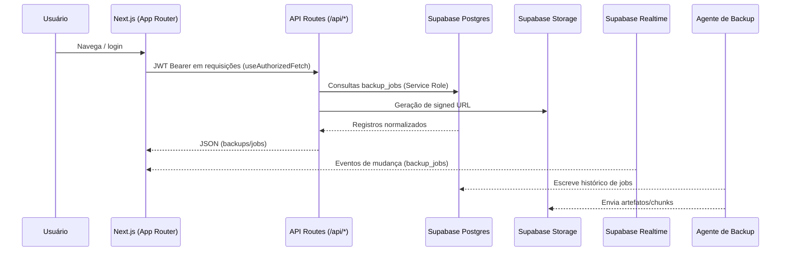

# Visão Geral do Sistema

**Nome do Projeto**: Keeply Backup System (Frontend Web)

## Propósito do sistema
- Fornecer interface web moderna para gestão de backups pessoais e de pequenas equipes.
- Expor painel autenticado para acompanhar execuções, restaurar arquivos via URLs assinadas e monitorar dispositivos.
- Servir como camada de apresentação para APIs internas e recursos Supabase (Auth, Postgres, Storage e Realtime).

## Problema de negócio que resolve
- Centraliza a visibilidade do ciclo de vida de backups (execução, status, métricas e restauração), reduzindo esforço manual.
- Reduz risco de perda de dados ao permitir restauração rápida e segura sem acesso direto à infraestrutura.
- Proporciona onboarding guiado (landing/marketing) para instalação do agente de backup e ativação de dispositivos.

## Escopo do projeto
- **Dentro**: páginas públicas de marketing, fluxo completo de autenticação (login, registro, reset), painel autenticado (backups, jobs, dispositivos), APIs internas de leitura/remoção/URL assinada, métricas agregadas e canal Realtime.
- **Fora**: execução do agente de backup em hosts finais, processamento de dados/chunks, billing ou cobrança, e workflows de provisionamento de storage/banco (assumido como já criado no Supabase).

## Personas
- **Usuário final**: instala o agente, acompanha status de backups e dispara restaurações.
- **Administrador de suporte**: observa falhas, verifica saúde dos dispositivos e auxilia em incidentes.
- **Equipe de plataforma**: mantém segredos, monitora disponibilidade, opera CI/CD e guarda conformidade de acesso.

## Principais módulos / serviços
- **UI Next.js (App Router)** em `src/app` (landing + área autenticada) com componentes em `src/components` e estilos Tailwind em `src/styles`.
- **Contextos/Hooks de domínio** em `src/contexts` e `src/hooks` (AuthContext, useAuthorizedFetch, useBackups, useJobs, useAsyncTask).
- **APIs internas** (Next.js API Routes) em `src/app/api/**` para backups, jobs, métricas, devices/agents e health check.
- **Camada Supabase** em `src/lib` (`supabase.ts`, `constants.ts`, helpers `api.ts`, `utils.ts`).
- **Supabase BaaS**: Auth (JWT), Postgres (tabelas de histórico), Storage (bucket `backups`), Realtime (assinaturas por tabela).

# Contexto e Requisitos

## Requisitos Funcionais
- Autenticar usuários via Supabase Auth (email/senha) com sessão persistente e logout global (`AuthContext`).
- Listar e normalizar histórico de backups (`backup_jobs`) com filtros por limite e dispositivo; remover registros do usuário autenticado.
- Gerar URLs assinadas temporárias para restaurar arquivos no bucket `backups`.
- Assinar canais Realtime para receber inserts/updates/deletes de `backup_jobs` e refletir na UI.
- Exibir métricas agregadas (total de backups, tamanho, usuários únicos, uploads por dia) para landing/dashboard via `/api/metrics`.
- Disponibilizar health check de API (`/api/health`) para monitoração externa.
- Fluxos de marketing e onboarding (landing, pricing, FAQ, cadastro/recuperação de senha em `src/app/landingPage/**`).

## Requisitos Não Funcionais
- **Disponibilidade**: aderir ao SLA do Supabase; UI deve tolerar falhas de rede com mensagens e opção de refresh.
- **Desempenho**: build Next.js otimizado; queries paginadas (limite máx. 500 em `/api/backups`, 100 em `/api/jobs`); carregamento inicial < 3s em redes comuns.
- **Segurança**: autenticação obrigatória com JWT Bearer; validação de ownership antes de operações de backup; TTL mínimo de 30s em URLs assinadas.
- **Escalabilidade**: frontend stateless (pode ser distribuído em edge ou múltiplas réplicas); uso de BaaS reduz sobrecarga operacional.
- **Observabilidade**: logs de API via plataforma de deploy e painel Supabase; métricas expostas em `/api/metrics`; health check simples.
- **Confiabilidade**: mapeamento de estados de job para UI coerente; fallback REST logout para evitar sessões zumbis.
- **Backup/Restore**: responsabilidade principal do Supabase Storage/Postgres; frontend apenas orquestra e valida acesso.

## Restrições e Premissas
- Variáveis obrigatórias: `NEXT_PUBLIC_SUPABASE_URL`, `NEXT_PUBLIC_SUPABASE_ANON_KEY`, `SUPABASE_SERVICE_ROLE_KEY` (validadas em build por `scripts/validate-env.mjs`).
- Infra Supabase pré-provisionada com tabelas/bucket definidos em `src/lib/constants.ts` (`backup_jobs`, `snapshots`, `snapshot_files`, `snapshot_file_chunks`, `agents`, `agent_tasks`, `agent_api_keys`, bucket `backups`).
- Assunção: acesso HTTPS aberto ao Supabase; sem VPN/certificado customizado.
- Limitação atual: criação de jobs via API (`POST /api/jobs`) retorna 405 (não implementado). Upload de arquivos com metadados persistidos é parcial (`uploadToStorage` apenas faz upload).

# Arquitetura de Alto Nível

- **Estilo**: aplicação Next.js (App Router) com páginas híbridas (SSR/SSG) e API Routes serverless; integrações com Supabase para Auth, DB, Storage e Realtime. Paradigma orientado a eventos para atualizações em tempo real.
- **Componentes-chave**:
  - UI React/Tailwind (`src/app`, `src/components`), contendo landing e painel autenticado.
  - Contexto de autenticação (`AuthContext`), hooks de fetch autorizado (`useAuthorizedFetch`) e domínio (`useBackups`, `useJobs`).
  - API Routes (`src/app/api/**`) que validam JWT via `requireAuth` e usam client Service Role.
  - Serviços Supabase (Auth/Postgres/Storage/Realtime) e agente externo que grava histórico e objetos.
- **Fluxo de dados ponta a ponta**:
  1. Usuário acessa UI → `AuthContext` inicializa sessão com Supabase SDK.
  2. Hooks obtêm token via `getAccessToken` e chamam `/api/backups`, `/api/jobs`, `/api/backups/download` etc.
  3. APIs validam token, consultam Postgres (`backup_jobs`) e Storage (`backups`) com Service Role e retornam payload normalizado.
  4. Canais Realtime são assinados para `backup_jobs`; eventos atualizam estado React em tempo real.
  5. Downloads ocorrem via signed URL temporária emitida pela API; agente utiliza o arquivo restaurado conforme metadados.



# Componentes e Módulos

## UI Next.js (App Router)
- **Tipo**: Frontend SSR/SSG com rotas em `src/app` e componentes em `src/components`.
- **Responsabilidades**: landing/marketing, formulários de auth, dashboard de backups/devices/jobs, consumo de APIs internas.
- **Interfaces expostas**: rotas públicas em `src/app/landingPage/**`; rotas autenticadas em `src/app/personal/**`.
- **Depende de**: AuthContext, hooks de domínio, Tailwind, Supabase SDK (client-side para sessão).
- **Consumido por**: usuários finais e admins via browser.

## AuthContext (`src/contexts/AuthContext.tsx`)
- **Tipo**: Contexto React client.
- **Responsabilidades**: gerenciar sessão Supabase, sign-in/up/out, reset de senha, refresh de sessão e fornecimento de JWT.
- **Interfaces**: `signIn`, `signUp`, `signOut`, `resetPassword`, `getAccessToken`, estado `user`/`loading`.
- **Depende de**: `@supabase/supabase-js`, variáveis públicas de ambiente.
- **Consumido por**: hooks (`useAuthorizedFetch`, `useBackups`, `useJobs`) e componentes protegidos.

## Hook useAuthorizedFetch (`src/hooks/useAuthorizedFetch.ts`)
- **Tipo**: utilitário de fetch autenticado.
- **Responsabilidades**: recuperar token via `getAccessToken`, anexar header `Authorization`, serializar JSON, lançar erros HTTP coerentes.
- **Entradas/Saídas**: recebe `input`, `options` e retorna respostas parseadas (`json` default, ou texto/blob conforme opção).

## Hooks de domínio
- **useBackups (`src/hooks/useBackups.ts`)**: lista backups, gera signed URL, remove backup, assina Realtime para `backup_jobs`; aceita opções (`limit`, `auto`, `realtime`).
- **useJobs (`src/hooks/useJobs.ts`)**: lista jobs por dispositivo/status, normaliza status, assina Realtime; retorna `jobs`, `refresh` e `createJob` (stub 405).
- **useAsyncTask (`src/hooks/useAsyncTask.ts`)**: controle de estado assíncrono (loading/error/value) compartilhado.

## API Routes (serverless) – principais
- **/api/backups (`GET`/`DELETE`)**: lista ou remove backups do usuário autenticado; valida `limit` (1–500) e ownership antes de deletar.
- **/api/backups/download (`POST`)**: recebe `{ id, expiresIn? }`, valida id do usuário e gera signed URL no bucket `backups` com TTL 30–3600s.
- **/api/jobs (`GET`)**: lista histórico normalizado, filtrando por `deviceId`, `status` (`pending|running|done|failed`) e `limit` (1–100); `POST` retorna 405.
- **/api/metrics (`GET`)**: agrega estatísticas globais (total de backups, tamanho total, usuários únicos, uploads últimos 7 dias, uploads por dia, tamanho médio) e dados de sistema (uptime/memória/node version/platform).
- **/api/health (`GET`)**: health check simples para monitoramento.
- Outros diretórios (`/api/devices`, `/api/agents`, `/api/agent-tasks`, `/api/auth`) existem para evolução futura; assumem mesma validação de auth.

## Camada Supabase (`src/lib`)
- **supabase.ts**: cria client público (anon) e helpers `createServerClient` com Service Role, garantindo presença de envs.
- **api.ts**: utilitários `requireAuth` (valida JWT, injeta client com Service Role) e `jsonError` (padroniza respostas com status e mensagem).
- **constants.ts**: nomes centralizados de tabelas/buckets.
- **utils.ts**: helpers de formatação (ex.: `formatFileSize`).

## Serviço de Storage (`src/lib/storage.ts`)
- **Tipo**: utilitário de upload.
- **Responsabilidades**: subir arquivos para bucket `backups` e retornar metadados; TODO explícito para persistir metadados em `snapshot_files`.

# Modelo de Dados

## Entidades principais (Supabase/Postgres)
- **backup_jobs** (histórico de execuções)
  - Campos: `id` (UUID, PK), `user_id` (UUID, FK Supabase auth), `set_id` (device), `type` (ex.: FULL/INCREMENTAL), `status` (STARTED/PROCESSING/COMPLETED/FAILED...), `root_path`, `files_scanned`, `files_processed`, `bytes_total`, `bytes_processed`, `chunks_new`, `chunks_reused`, `started_at`, `finished_at`, `error_message`, `storage_container_key`.
  - Índices recomendados: por `user_id`, `set_id`, `status`, `started_at DESC`.
- **snapshots** → **snapshot_files** → **snapshot_file_chunks**
  - Representam versões de arquivos com deduplicação por chunk; relações 1:N entre as tabelas (Assunção: PK UUIDs, FK para entidade pai).
- **agents** / **agent_tasks** / **agent_api_keys**
  - Inventário de agentes instalados, fila de tarefas (ex.: solicitar inventário, forçar backup) e chaves de API para comunicação.

## Esquema JSON exemplo (registro normalizado de backup)
```json
{
  "id": "c2f...",
  "user_id": "uuid-do-usuario",
  "filename": "home/docs.zip",
  "file_path": "users/uuid/backups/home/docs.zip",
  "file_size": 1048576,
  "file_type": "backup/full",
  "uploaded_at": "2024-12-10T10:00:00Z",
  "status": "COMPLETED",
  "started_at": "2024-12-10T09:55:00Z",
  "finished_at": "2024-12-10T10:00:00Z"
}
```

## Integridade e Consistência
- Ownership verificada em cada API (comparação `record.user_id` vs token).
- TTL controlado para URLs assinadas (30–3600s) reduz exposição.
- Eventos Realtime sincronizam estados locais, evitando divergência entre UI e DB.
- Auditoria delegada ao Supabase (logs de auth, storage, DB); campos de timestamp preservam histórico.
- Assunção: RLS habilitada nas tabelas, com policies por `user_id` para evitar acesso cruzado.

# APIs e Integrações

## APIs Internas

| Método | Path | Descrição | Body | Respostas |
| --- | --- | --- | --- | --- |
| GET | `/api/backups?limit={1-500}` | Lista backups do usuário autenticado | — | 200 `{ backups: BackupFile[] }`; 400 input inválido; 401/403 auth |
| DELETE | `/api/backups?id=UUID` | Remove backup (DB) após validar ownership | — | 200 `{ ok: true }`; 400/403/404 erros de validação |
| POST | `/api/backups/download` | Gera URL assinada para objeto no bucket | `{ id: string, expiresIn?: number }` | 200 `{ signedUrl, expiresIn }`; 400/403/404/500 |
| GET | `/api/jobs?deviceId=...&status=...&limit=...` | Lista jobs normalizados | — | 200 `{ jobs: Job[] }`; 400 input inválido |
| POST | `/api/jobs` | (stub) criação não suportada | — | 405 com mensagem |
| GET | `/api/metrics` | Métricas globais e info de sistema | — | 200 `{ metrics, system }`; 500 erro interno |
| GET | `/api/health` | Health check simples | — | 200 `{ ok: true }` (assunção) |

## Integrações Externas
- **Supabase Auth**: login/registro/reset via SDK; logout com `signOut({ scope: 'global' })` e fallback REST `POST /auth/v1/logout`.
- **Supabase Postgres**: consultas/DELETE em `backup_jobs` e demais tabelas via Service Role (server-side).
- **Supabase Storage**: bucket `backups` para uploads/downloads; URLs assinadas emitidas nas APIs server-side.
- **Realtime**: canais por tabela `backup_jobs` (e extensível a outras) para refletir mutações na UI.
- **Dotenv**: carregamento de envs em build/dev; secrets configurados na plataforma em produção.

# Fluxos Críticos do Sistema

## Login / Sign-up / Reset
1. Usuário envia credenciais nos formulários da landing (`/landingPage/login` ou `/landingPage/register`).
2. `AuthContext.signIn/signUp` chama Supabase Auth; em sign-up preenche metadados (display_name, phone, billing, etc.).
3. Sessão JWT é armazenada pelo SDK; `AuthContext` atualiza `user`/`loading` e UI redireciona para `/personal/dashboard`.
4. Reset de senha usa `resetPasswordForEmail` com `redirectTo` configurado em `NEXT_PUBLIC_SITE_URL`.

## Listagem de backups
1. `useBackups` é inicializado (auto=true) em páginas autenticadas.
2. Hook chama `GET /api/backups` com header Bearer; parâmetro `limit` opcional.
3. API valida token e retorna registros normalizados (filename/path/size/status/started/finished).
4. Realtime assina `backup_jobs`; inserts/updates/deletes atualizam estado local automaticamente.

## Download seguro
1. Usuário escolhe backup → `createSignedUrl` faz `POST /api/backups/download` com `id` e `expiresIn` opcional.
2. API valida ownership e presence de `storage_container_key`, chama `storage.createSignedUrl` com TTL.
3. UI abre a URL assinada para download/restauração; expiração impede reuso prolongado.

## Monitoramento de jobs por dispositivo
1. `useJobs` recebe `deviceId/status/limit` e executa `GET /api/jobs` com filtros.
2. API traduz status friendly para enums internos e consulta `backup_jobs` ordenando por `started_at`.
3. Hook normaliza payload/result (erro ou estatísticas) e status (`pending/running/done/failed`).
4. Realtime mantém lista sincronizada enquanto o usuário permanece na tela.

## Métricas de landing/dashboard
1. Landing ou widget de métricas chama `GET /api/metrics` (sem auth).
2. API agrega estatísticas em memória (total backups, bytes, usuários únicos, uploads por dia) e retorna snapshot + metadados do processo.
3. UI renderiza contadores e séries temporais; falhas retornam JSON de erro para fallback.

# Infraestrutura e Deploy

- **Ambientes**: DEV local (`npm run dev`), HML/PRD em Vercel ou container Docker (assunção). Variáveis `.env.local` em dev; secrets gerenciados na plataforma em produção.
- **Build/Runtime**: Node 20; Next.js com App Router. APIs executam como funções serverless (edge ou node) junto à UI.
- **Rede**: tráfego HTTPS direto para Supabase; sem VPN. TLS obrigatório tanto para Auth quanto Storage.
- **CI/CD**: pipeline esperado (GitHub Actions/Vercel) rodando `npm ci`, `npm run lint` (se configurado) e `npm run build`; `scripts/validate-env.mjs` garante envs.
- **Rollback**: reverter deploy na plataforma (redeploy da build anterior ou imagem precedente).
- **Config por ambiente**: URLs/keys Supabase e `NEXT_PUBLIC_SITE_URL` variam; resto do código é imutável.

# Segurança

- **Autenticação**: Supabase Auth com email/senha; sessão mantida pelo SDK. Logout global para encerrar sessões em todos os dispositivos.
- **Autorização**: middleware `requireAuth` valida JWT em todas APIs protegidas e compara `user_id` antes de operar.
- **RLS/Policies**: assumir políticas por `user_id` no Supabase para tabelas `backup_jobs` e relacionadas.
- **Segredos**: Service Role Key e Anon Key mantidas em variáveis de ambiente; jamais expor Service Role no client.
- **Criptografia**: HTTPS em trânsito; criptografia em repouso provida pelo Supabase (DB/Storage).
- **Rede**: acesso direto apenas aos endpoints Supabase públicos; restringir origens CORS na plataforma.
- **Auditoria**: logs de autenticação/DB/Storage via painel Supabase; trilha de quem gerou URLs assinadas pode ser inferida pelo usuário autenticado e timestamps.
- **Riscos e mitigação**: exposição de signed URLs (mitigar com TTL curto), abuso de DELETE (mitigar via ownership + RLS + rate-limit no edge), vazamento de Service Role (mitigar mantendo server-side e rotate de chaves).

# Observabilidade e Operação

- **Métricas chave**: total de backups, bytes totais, usuários ativos, uploads últimos 7 dias, uploads/dia, tempo médio de backup (derivado de started/finished), consumo de memória e uptime da API (expostos em `/api/metrics`).
- **Logs**: console frontend para debugging local; logs de API (Next.js) e DB/Storage disponíveis no provider. Recomendado integrar com serviços (Logflare/Datadog) para produção.
- **Traces**: não implementado; possível integrar OpenTelemetry no Next.js handler e client.
- **Health checks**: `/api/health` para monitoramento externo; pode ser usado por load balancers.
- **Rotinas operacionais**: revisar falhas em `backup_jobs` (status FAILED), rotacionar chaves periódicas, verificar crescimento de bucket e políticas de retenção.

# Backup, Recuperação e Resiliência

- **Backup**: dados persistidos em Supabase Postgres (`backup_jobs`, snapshots) e Storage (`backups`). Agente envia chunks e atualiza histórico.
- **Retenção**: assumida política de 30 dias na landing; configurável no backend/Storage.
- **Restore**: iniciado via UI → signed URL → download do artefato → agente reconstitui árvore a partir de chunks.
- **Resiliência**: frontend stateless; Realtime mantém consistência de estado; fallbacks de logout/erro evitam estados inválidos.

# Testes e Qualidade

- **Tipos**: validação de ambiente em `prebuild` (`scripts/validate-env.mjs`); testes unitários/e2e ainda não presentes (assunção).
- **Como rodar**:
  - Dev: `npm install` → `npm run dev`.
  - Build: `npm run build` (executa validação de env). Opcional rodar `npm run lint` se configurado.
- **Critérios mínimos**: build sem erros; envs obrigatórias presentes. Recomenda-se adicionar lint/coverage em roadmap.

# Roadmap Técnico e Evoluções Futuras
- Implementar criação de jobs/restore via UI e endpoint `POST /api/jobs`.
- Persistir metadados em `snapshot_files`/`snapshot_file_chunks` no upload (`uploadToStorage`).
- Adicionar testes automatizados (unit/integration/e2e) e linting consistente.
- Integrar observabilidade (OpenTelemetry) e dashboards (Prometheus/Grafana ou Logflare/Datadog).
- Endurecer RLS/policies e controles de rate-limit; permitir TTL custom por perfil.
- Expor painel de dispositivos/agents completo (ativação, tarefas, chaves) usando rotas existentes em `/api/agents` e `/api/agent-tasks`.

# Guia Rápido para Novos Desenvolvedores
- **Pré-requisitos**: Node 20+, npm, conta Supabase configurada com tabelas/bucket listados.
- **Setup local**:
  1. `cp .env.example .env.local` (se disponível) e preencha `NEXT_PUBLIC_SUPABASE_URL`, `NEXT_PUBLIC_SUPABASE_ANON_KEY`, `SUPABASE_SERVICE_ROLE_KEY`, `NEXT_PUBLIC_SITE_URL`.
  2. `npm install`.
  3. `npm run dev` e acesse `http://localhost:3000`.
- **Comandos úteis**: `npm run dev` (hot reload), `npm run build` (produção), `npm start` (serve build). Rodar `npm run lint` se configurado.
- **Onde começar a ler**: `src/contexts/AuthContext.tsx` (auth), `src/hooks/useAuthorizedFetch.ts` (fetch), `src/hooks/useBackups.ts` e `src/hooks/useJobs.ts` (domínio), `src/app/api/**` (APIs), `src/lib/supabase.ts` (config Supabase).
- **Times/contato**: assumir canal interno (Slack/Teams) e owners de plataforma para segredos/infra.

# Glossário Técnico
- **Supabase**: BaaS com Auth/Postgres/Storage/Realtime.
- **Service Role Key**: chave privilegiada usada apenas server-side para bypass de RLS.
- **Signed URL**: URL temporária que permite download seguro de objeto no Storage.
- **Backup Job**: execução de backup armazenada em `backup_jobs` com status e metadados.
- **Snapshot**: versão de um conjunto de arquivos com deduplicação via chunks.
- **Realtime**: canal de notificações de mutações em tabelas Postgres entregue via websockets.
- **Agent**: software cliente que envia dados/chunks e atualiza histórico no Supabase.