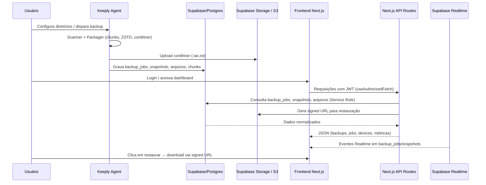
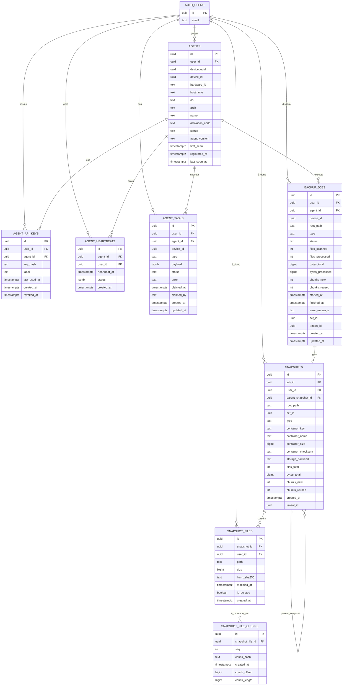
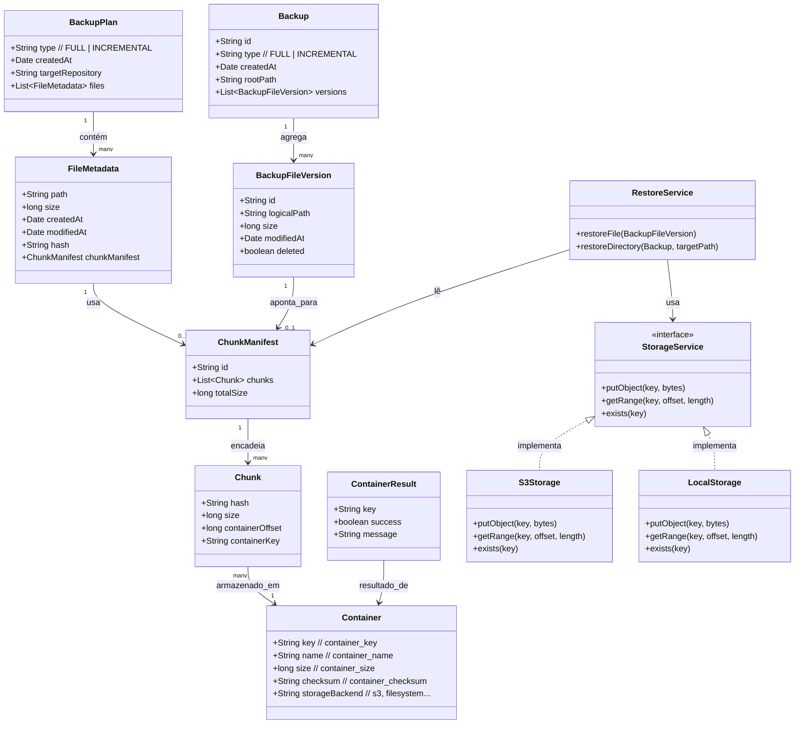
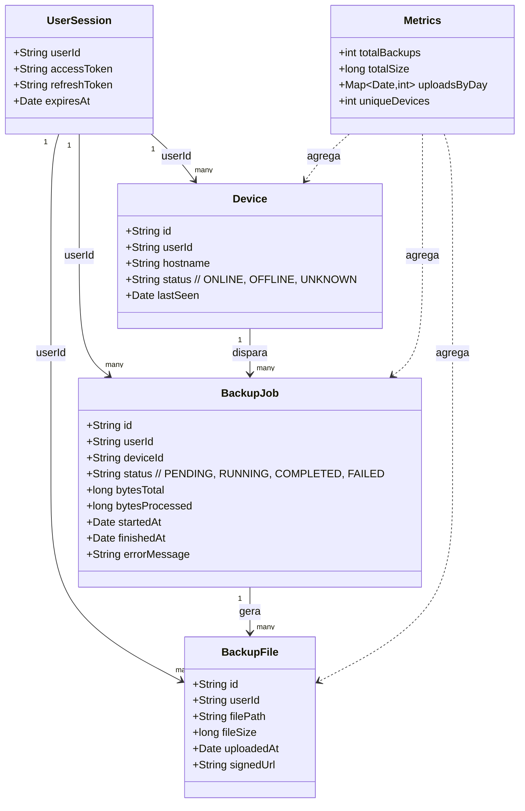

# Keeply – Sistema Distribuído de Backup com Painel Web

> Agente de backup com deduplicação por chunks + painel Next.js/Supabase para observabilidade e restauração.

---

## 1. Visão Geral

**Keeply** é uma solução de backup distribuído composta por três blocos principais:

* **Keeply Backup Agent (Java)**
  Roda na máquina do usuário/cliente, varre diretórios, gera planos de backup FULL/INCREMENTAL, deduplica dados em chunks, empacota em contêineres comprimidos (`.tar.zst` com cabeçalho KBC) e envia para filesystem local ou storage compatível com S3.
  Registra metadados em banco relacional (PostgreSQL / Supabase / SQLite), permitindo restauração granular e auditável.

* **Keeply Backup System – Frontend Web (Next.js + Supabase)**
  Aplicação web que autentica usuários, exibe backups, jobs, dispositivos, métricas e gera URLs assinadas para restauração de arquivos armazenados no bucket de backups do Supabase Storage.
  Usa Supabase como BaaS (Auth, Postgres, Storage e Realtime).([Supabase][1])

* **Domínio de Banco de Dados (Postgres/Supabase)**
  Conjunto de tabelas que amarram tudo: usuários (auth), agentes, tasks, jobs, snapshots, arquivos e chunks, com suporte a deduplicação global e RLS por usuário.

### Problema de negócio

* Reduzir custo de armazenamento de backup por meio de **deduplicação por chunks** e compressão eficiente.
* Diminuir a janela de recuperação em incidentes de perda de dados.
* Centralizar a visibilidade do ciclo de vida de backups (jobs, snapshots, arquivos) em um **painel web** simples, sem exigir acesso direto à infraestrutura.
* Permitir que usuários e equipes de TI façam restaurações seguras via URLs assinadas (sem expor diretamente S3 ou o Supabase Storage).([Supabase][1])

### Personas

* **Usuário final / power user** – instala o agente, acompanha backups e dispara restaurações.
* **Administrador de TI/DevOps** – configura diretórios, monitora jobs, resolve falhas.
* **Equipe de plataforma** – cuida da infraestrutura Supabase/Cloud, segredos e CI/CD.

---

## 2. Escopo do Projeto

### Incluído

* Agente:

  * Scanner de diretórios; planos FULL/INCREMENTAL.
  * Deduplicação por chunks, compressão ZSTD, contêineres `.tar.zst` com cabeçalho KBC.
  * Persistência relacional de metadados (backups, versões, chunks, contêineres).
  * Upload/download via filesystem ou S3 compatível.
  * Restauração completa ou parcial.
  * Scheduler e interface de controle (CLI e opcionalmente JavaFX).

* Frontend:

  * Landing pages (marketing, pricing, FAQ, onboarding).
  * Fluxos de login, registro e recuperação via Supabase Auth.
  * Dashboard autenticado com lista de backups, jobs e dispositivos.
  * Geração de URLs assinadas para download seguro.
  * Métricas agregadas e assinatura Realtime para jobs/eventos.

* Banco de Dados:

  * Modelo relacional para agentes, chaves de API, heartbeats, tasks, jobs, snapshots, arquivos e chunks.
  * Suporte a políticas de segurança em nível de linha (RLS) e ownership por `user_id`.([permit.io][2])

### Fora de escopo (versão atual)

* Multi-tenant completo e RBAC avançado.
* Billing/cobrança automática.
* Políticas complexas de retenção automática (GFS, etc.).
* Observabilidade avançada (tracing distribuído, alertas automáticos sofisticados).

---

## 3. Arquitetura de Alto Nível

### Panorama

* **Keeply Agent** roda em endpoints, gerando contêineres de backup e gravando metadados.
* **Supabase/Postgres + Storage** armazenam metadados e dados de backup.
* **Frontend Next.js** consome esses dados, aplica regras de auth/autorização e apresenta tudo em UI.



---

## 4. Componentes Principais

### 4.1 Keeply Backup Agent (Java 21)

* **Scanner**
  Percorre diretórios configurados, detecta novos/alterados/deletados, gera `BackupPlan` FULL ou INCREMENTAL com lista de `FileMetadata`.

* **Metadata Store**
  Persiste:

  * Jobs de backup.
  * Arquivos e versões (snapshot_files).
  * Relação arquivo → chunks (snapshot_file_chunks).
  * Contêineres e estatísticas (bytes, chunks novos vs reutilizados).

* **Packager**
  Divide arquivos em chunks, calcula hashes, consulta índice de dedupe, comprime com ZSTD, monta contêiner `.tar.zst` com cabeçalho KBC (offsets, hashes, manifestos).

* **Storage Service**
  Interface única (`StorageService`) com implementações:

  * `S3Storage`: storage compatível com S3 (AWS S3, Supabase Storage compatível, etc.).([Supabase][1])
  * `LocalStorage`: filesystem local.

* **Scheduler**
  Agenda execuções (ex.: FULL semanal, INCREMENTAL diário) e gerencia locks para evitar concorrência na mesma origem.

* **Restore Service**
  Usa metadados (snapshots, manifestos, offsets) + contêineres para reconstruir arquivos, validando integridade pelos hashes.

* **Interface de Controle**
  CLI (e opcional JavaFX) para iniciar backup, listar snapshots, ver logs, disparar restore.

### 4.2 Frontend Web (Next.js + Supabase)

* **Stack**

  * Next.js (App Router), React, TypeScript, Tailwind CSS.
  * Supabase Auth / Postgres / Storage / Realtime.([Supabase][1])

* **Principais pastas (sugerido)**

  * `src/app`: rotas públicas (landing, FAQ, pricing) e área autenticada (`/personal/**`).
  * `src/components`: cards, tabelas, gráficos, layouts.
  * `src/contexts`: `AuthContext` (sessão Supabase).
  * `src/hooks`: `useAuthorizedFetch`, `useBackups`, `useJobs`, `useAsyncTask`.
  * `src/lib`: `supabase.ts`, `api.ts` (requireAuth/jsonError), `constants.ts`, `utils.ts`.

* **APIs internas (`/api/**`)**

  * `/api/backups` – lista e remove backups, validando `user_id`.
  * `/api/backups/download` – gera signed URL temporária para download.
  * `/api/jobs` – histórico de jobs (por device/status).
  * `/api/metrics` – métricas agregadas (backups, bytes, uploads/dia, etc.).
  * `/api/health` – health check simples.

* **Fluxos principais**

  * Login/Sign-up/Reset com Supabase Auth.
  * Dashboard autenticado com cards de métricas, tabela de backups e lista de dispositivos.
  * Realtime para `backup_jobs`, atualizando UI sem reload.

### 4.3 Domínio de Banco de Dados (Postgres / Supabase)

O domínio de banco foi pensado para integrar:

* **Identidade e Dispositivos**

  * `auth.users` (Supabase Auth) – origem de identidade.([permit.io][2])
  * `agents` – instâncias do agente vinculadas a um usuário e a um `device_id`.
  * `agent_api_keys` – chaves de API associadas a agentes.
  * `agent_heartbeats` – batimentos periódicos com status do agente.
  * `agent_tasks` – fila de tarefas (BACKUP, RESTORE, etc.) enviadas ao agente.

* **Execuções de Backup e Snapshots**

  * `backup_jobs` – cada execução de backup (FULL/INCREMENTAL) com status, root_path, contadores de arquivos, bytes, chunks.
  * `snapshots` – estado de arquivos em um momento, vinculado a um job e opcionalmente a um snapshot pai (cadeia FULL + INCREMENTAL).

* **Arquivos e Chunks Deduplicados**

  * `snapshot_files` – arquivos de um snapshot (path, size, hash, `is_deleted`).
  * `snapshot_file_chunks` – sequência de chunks de cada arquivo (hash, offset, length).

Essa estrutura permite:

* Rastrear de um **usuário** → **agente/dispositivo** → **jobs** → **snapshots** → **arquivos** → **chunks**.
* Implementar **deduplicação global** (reuso de chunks entre execuções).
* Expor ao frontend visões como “arquivos restauráveis” e “métricas agregadas”.

---

## 5. Requisitos (Resumo)

### 5.1 Funcionais – Agente

* Varredura de diretórios configuráveis, com planos FULL/INCREMENTAL.
* Deduplicação por chunks com reuso entre execuções.
* Empacotamento em `.tar.zst` com cabeçalho KBC (offsets, hashes).
* Persistência de metadados (backups, versões, chunks, contêineres).
* Upload/download via filesystem ou S3, com leitura por faixa e retomada.
* Restauração completa ou parcial, com validação de integridade.
* Interface de controle (CLI/JavaFX) para iniciar/pausar/cancelar jobs.
* Registro de histórico com horários, status, volume, dedupe.

### 5.2 Funcionais – Frontend

* Autenticação via Supabase Auth (login, registro, recuperação de senha).
* Listagem de backups com filtros por dispositivo e status.
* Geração de URLs assinadas temporárias para download seguro.
* Remoção de backups com validação de propriedade.
* Assinatura Realtime para jobs e atualizações instantâneas.
* Exibição de métricas em cards e gráficos.
* Landing page com seções de produto, preços, FAQ e formulários integrados.

### 5.3 Não Funcionais (Sistema como um todo)

* **Disponibilidade** – tolerar falhas de rede/storage com retries e feedback claro.
* **Desempenho** – throughput adequado no agente; dashboard carregando em poucos segundos.
* **Segurança** – TLS, hashes fortes, segredos em env, RLS por `user_id`, signed URLs com TTL curto.([Supabase][1])
* **Escalabilidade** – frontend stateless; dedupe global; uso de BaaS reduzindo complexidade operacional.
* **Observabilidade** – logs estruturados, métricas expostas em `/api/metrics` e via Supabase.
* **Confiabilidade** – contêineres gerados de forma atômica, transações de metadados consistentes.
* **Usabilidade** – CLI com ajuda contextual; frontend responsivo e claro.
* **Acessibilidade** – foco visível, contraste adequado, texto alternativo.

---

## 6. Modelo de Dados (ER) – Domínio do Banco

Diagrama ER em Mermaid (Domínio do banco – Supabase/Postgres):



---

## 7. Domínio de Classes

### 7.1 Domínio do Agente



### 7.2 Domínio do Frontend



---

## 8. Getting Started (Resumo)

### 8.1 Frontend (Next.js)

**Pré-requisitos**

* Node.js 20+
* Conta Supabase com:

  * Auth configurado.
  * Tabelas: `backup_jobs`, `snapshots`, `snapshot_files`, `snapshot_file_chunks`, `agents`, `agent_tasks`, `agent_api_keys`, etc.
  * Bucket `backups` no Supabase Storage.([Supabase][1])

**Passos básicos**

```bash
# instalar dependências
npm install

# configurar variáveis de ambiente
cp .env .env.local   # ou crie .env.local com as variáveis exigidas
# preencher:
# NEXT_PUBLIC_SUPABASE_URL
# NEXT_PUBLIC_SUPABASE_ANON_KEY
# SUPABASE_SERVICE_ROLE_KEY
# NEXT_PUBLIC_SITE_URL

# rodar em modo dev
npm run dev
# acessar http://localhost:3000

# exemplo de `.env.local`
NEXT_PUBLIC_SUPABASE_URL=https://seu-projeto.supabase.co
NEXT_PUBLIC_SUPABASE_ANON_KEY=chave-anon
SUPABASE_SERVICE_ROLE_KEY=chave-service-role
NEXT_PUBLIC_SITE_URL=http://localhost:3000
NEXT_PUBLIC_BACKEND_URL=http://localhost:3000
DEVICE_API_BASE_URL=http://localhost:3000
```

### 8.2 Agent (Java)

**Pré-requisitos**

* JDK 21+
* Maven 3.9+
* Postgres/Supabase ou SQLite.
* Storage local ou S3 compatível.

**Build e execução**

```bash
# build
mvn clean package

# roda o agente (fat JAR)
java -jar target/backup-agent-*.jar

# (opcional) UI JavaFX
mvn javafx:run
```

Configuração via `.env` ou arquivo de propriedades para:

* `SUPABASE_URL`, `SUPABASE_ANON_KEY`, `SUPABASE_EMAIL`/`SUPABASE_PASSWORD` (ou `SUPABASE_REFRESH_TOKEN`) – autenticação do agente no Supabase.
* `KEEPLY_AGENT_KEY` – chave simétrica usada para criptografar o refresh token persistido.
* `DEVICE_API_BASE_URL` – endpoint do painel/Next.js utilizado para ativação e polling de tarefas.
* `BACKUP_STORAGE` (`s3` ou `local`) e `LOCAL_STORAGE_DIR` – controlam o destino dos contêineres.
* `AWS_S3_BUCKET`, `AWS_S3_REGION`, `AWS_ACCESS_KEY_ID`, `AWS_SECRET_ACCESS_KEY` (e opcionais como `AWS_S3_UPLOAD_MANIFESTS`) – credenciais e parâmetros quando `BACKUP_STORAGE=s3`.

---

## 9. Segurança, Observabilidade e Roadmap (bem resumido)

* **Segurança**

  * TLS para acesso a Supabase e S3.
  * Segredos somente em backend (Service Role Key nunca no client).
  * RLS por `user_id` nas tabelas de backup.
  * URLs assinadas com TTL curto e uso pontual.

* **Observabilidade**

  * Logs estruturados por `backup_id` / job.
  * Métricas em `/api/metrics` + painel Supabase para DB/Storage.
  * Health checks (`/api/health` e, se exposto, `/actuator/health` no agente).

* **Roadmap**

  * Multi-tenant completo e RBAC avançado.
  * Políticas automáticas de retenção.
  * Integração com ferramentas externas de monitoramento/alerta.
  * Criptografia fim a fim dos payloads em repouso (chaves gerenciadas separadamente).

---

## 10. Glossário

* **Chunk** – bloco de dados usado para deduplicação.
* **Contêiner** – arquivo comprimido (`.tar.zst`) que agrupa chunks de backup.
* **Snapshot** – visão do conjunto de arquivos em um determinado momento.
* **Deduplicação global** – reuso do mesmo chunk em vários backups.
* **Supabase** – BaaS open source com Postgres, Auth, Storage e Realtime.([Wikipedia][3])
* **Signed URL** – URL temporária para acessar um objeto de storage de forma segura.
* **Realtime** – mecanismo do Supabase para receber eventos do banco em tempo quase real.([Supabase][1])
